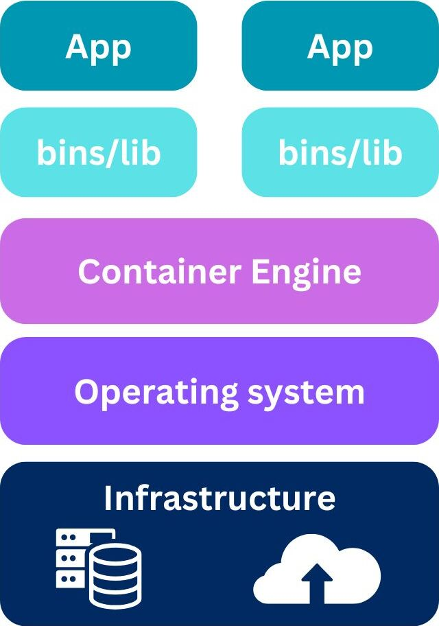

## Setting up environment
## Docker-compose.yml

### Mariadb
#### Dockerfile
**FROM** Deciding what version of Alpine we want to choose for this container. At the moment **3.19** is a penultimate stable version of Alpine
```
FROM alpine:3.19.2
```
**RUN**: Updating the list of packages to the newest versions and adding Mariadb server, client that connects to that server and bash. Bash is needed since our entrypoint script is written in bash
```
RUN apk update && \
    apk add mariadb mariadb-client bash
```
**COPY**: Copying entrypoint script from local storage into Docker image at `/usr/local/bin`
```
COPY tools/mariadb-entrypoint.sh /usr/local/bin/
```
**RUN**: Changing permissions of the entrypoint script to executable
```
RUN chmod +x /usr/local/bin/mariadb-entrypoint.sh
```
**ENTRYPOINT**: Sets the main executable for the mariadb container
```
ENTRYPOINT [ "mariadb-entrypoint.sh" ]
```
#### mariadb-entrypoint.sh
```
#!/bin/bash
set -e  # Exit immediately if a command exits with a non-zero status

# Configuration file for MariaDB
MARIADB_CONFIG="/etc/my.cnf.d/mariadb-server.cnf"
FIRST_RUN_FLAG="/etc/.firstrun"
FIRST_MOUNT_FLAG="/var/lib/mysql/.firstmount"

# Function to configure the server for the first run
configure_server() {
    echo "Configuring MariaDB server for the first run..."
    cat << EOF >> "$MARIADB_CONFIG"
[mysqld]
bind-address=0.0.0.0  # Allow connections from any IP address
skip-networking=0     # Enable networking
EOF
    touch "$FIRST_RUN_FLAG"  # Mark that the configuration has been applied
}
```
```

```

### Nginx
#### Dockerfile
```
FROM alpine:3.19.2

RUN apk update && \
    apk add nginx openssl bash

COPY tools/nginx-entrypoint.sh /usr/local/bin/

RUN chmod +x /usr/local/bin/nginx-entrypoint.sh && \
    mkdir -p /etc/nginx/ssl

ENTRYPOINT [ "nginx-entrypoint.sh" ]
```
#### nginx-entrypoint.sh
### Wordpress
#### Dockerfile


#### wordpress-entrypoint.sh

## Docker Compose
## Makefile
+ Variables:
```
NAME = Inception

DOCKER_COMPOSE_FILE := ./srcs/docker-compose.yml
ENV := srcs/.env
DATA := $(HOME)/data
WORDPRESS_DATA := $(DATA)/wordpress
MARIADB_DATA := $(DATA)/mariadb

WORDPRESS_CONTAINER_NAME := wordpress
MARIADB_CONTAINER_NAME := mariadb
```
+ Rules:
```
all: check_running

build: create_dirs up_build
```
**stop**: Stops all the running containers
```
stop:
     docker-compose -f $(DOCKER_COMPOSE_FILE) --env-file $(ENV) stop   
```
In **down** rule with the `docker-compose` command we are stopping and removing containers and removing networks. If we add `--volume` command can also delete volumes
```
down:
        @printf "$(YELLOW)Stopping configuration $(NAME)...$(RESET)\n"
        @docker-compose -f $(DOCKER_COMPOSE_FILE) --env-file $(ENV) down

re: fclean create_dirs up_build
```
**clean** Removes all stopped containers, unused images, unused networks and build cache. Ensures everything is cleaned up
```
clean: down
        @printf "$(YELLOW)Cleaning remaining elements...$(NAME)...$(RESET)\n"
        @docker system prune -a --force
```
**fclean**: performs `clean` and if volumes are detected deletes them and deletes directory `data`
```
fclean: clean
        @printf "$(YELLOW)Removing all volumes...$(RESET)\n"
 @if [ -n "$$(docker volume ls -q)" ]; then \
                docker volume rm $$(docker volume ls -q); \
        else \
                printf "No volumes to remove.\n"; \
        fi
        @printf "$(YELLOW)Removing all data directories...$(RESET)\n"
        @sudo rm -fr $(DATA)
        @printf "$(GREEN)Full cleanup completed!$(RESET)\n"
```
**logs**: Streams live logs of all the services defined in a Docker Compose file and ontinues to display new logs as they are generated (`-f` flag)
```
logs:
        -@docker-compose -f $(DOCKER_COMPOSE_FILE) --env-file $(ENV) logs -f
```
**create_dirs**: if no data folder detected it's creating it and folders for wordpress and mariadb
```
create_dirs:
        @if [ -d "$(DATA)" ]; then \
                printf "$(BLUE)Data directory $(DATA) already exists.$(RESET)\n"; \
        else \
                printf "$(YELLOW)Data directory $(DATA) does not exist. Creating it alo>
                sudo mkdir -p $(DATA) $(WORDPRESS_DATA) $(MARIADB_DATA); \
        fi
```
**up**: It starts existing containers (based on previously built images). Does not rebuild the images unless absolutely necessary (e.g., if they don’t exist locally)
```
up:
        @printf "$(GREEN)Launching configuration $(NAME)...$(RESET)\n"
        @docker-compose -f $(DOCKER_COMPOSE_FILE) --env-file $(ENV) up -d
```
**up_build**: Rebuilds the images for all services defined in the Docker Compose file, regardless of whether the images already exist
```
up_build:
        @printf "$(GREEN)Building and launching configuration $(NAME)...$(RESET)\n"
        @docker-compose -f $(DOCKER_COMPOSE_FILE) --env-file $(ENV) up -d --build
```
**check_running**: it's checking if the containers are running then does nothing. In other case does a check for content inside `data`. If nonexistant creates needed folders and builds images, if it has content restarts containers
```
check_running:
 @container_status=$$(docker-compose -f $(DOCKER_COMPOSE_FILE) --env-file $(ENV)>
        if [ "$$container_status" ]; then \
                printf "Containers are already running. No need to relaunch.\n"; \
        else \
                printf "Containers are not running. Checking data directories...\n"; \
                if [ ! "$(ls -A $(WORDPRESS_DATA))" ] || [ ! "$(ls -A $(MARIADB_DATA))">
                        printf "$(BLUE)Data directories are empty. Triggering a rebuild>
                        $(MAKE) create_dirs; \
                        $(MAKE) up_build; \
                else \
                        printf "Data directories are not empty. Launching existing conf>
                        $(MAKE) up; \
                fi; \
        fi
.PHONY: all build down re clean fclean logs create_dirs up up_build check_running
```
## Other information
### How Docker Compose and Docker work?
#### Docker
Platform using containerization to automate deployment, scaling and management of aplications
**Containers**

**Docker engine**
**Basic commands**
- `docker build` - creates docekr image from Dockerfile
- `docker run` - runs container from an image
- `docker ps` - lists active containers
- `docker images` - lists available images
- `docker stop` - stops running container
- `docker rm` - removes container

#### Docker compose
- tool that helps managing multi-container Docker aplications.
- uses .yaml file where multi-container setup is defined. Services, networks and volumes are specified there.
  
**Basic Commands**
- `docker-compose up` - starts service from docker-compose.yml file
- `docker-compose down` - stops and removes containers scpecified in docker-compose file
- `docker-compose logs` - displays logs
- `docker-compose exec` - executes commands in a running container
- `docker-compose stop` - stops active containers

### What are differences between a Docker image used with docker compose and without it?


### The advantages of Docker comparing to VM
- **Lightweight** - docker containers share the host OS 

<div style="text-align: center;">
    <h3>VM vs Docker structure</h3>
    <div style="display: flex; justify-content: center;">
        
        
    </div>
</div>


## Extra features:
### Encrypting .env file
`openssl enc -aes-256-cbc -salt -pbkdf2 -iter 100000 -in .env -out .env.enc`
## Decrypting file
`openssl enc -d -aes-256-cbc -pbkdf2 -iter 100000 -in .env.enc -out .env`


